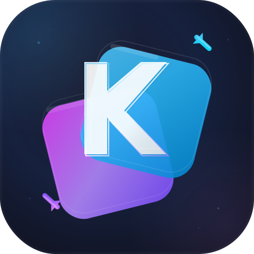

# Kopy

<p align="center">
  
</p>

<p align="center">A local-network clipboard and file-transfer tool for desktop and mobile devices.</p>

<p align="center">
  
  
  
</p>

Kopy connects a desktop computer and a phone on the same local network. It provides bidirectional text clipboard synchronization, local file transfer, and a camera-streaming mirror mode. The application is built with Flutter and uses a lightweight HTTP/WebSocket service hosted by the desktop app.

> Current scope: Kopy is designed for trusted local networks. The current protocol uses `http://` and `ws://`, has no authentication layer, and must not be exposed to the public Internet.

## Contents

- [Features](#features)
- [Supported platforms](#supported-platforms)
- [How it works](#how-it-works)
- [Quick start](#quick-start)
- [Connect a phone](#connect-a-phone)
- [Local protocol and API](#local-protocol-and-api)
- [Project structure](#project-structure)
- [Configuration](#configuration)
- [Permissions and platform notes](#permissions-and-platform-notes)
- [Development and testing](#development-and-testing)
- [Build and release](#build-and-release)
- [Troubleshooting](#troubleshooting)
- [Dependencies and licenses](#dependencies-and-licenses)
- [Contributing](#contributing)
- [Version history](#version-history)
- [License](#license)

## Features

### Bidirectional clipboard synchronization

- Desktop clipboard changes are broadcast to connected mobile clients in real time.
- A phone can push its current text clipboard to the desktop.
- Optional mobile clipboard monitoring checks for changes every two seconds.
- The desktop checks its clipboard every second while its local service is running.
- A feedback-loop guard prevents phone-originated writes from being broadcast back as new desktop changes.
- Returning to the foreground refreshes the clipboard, file list, and WebSocket connection.

### Local file transfer

- Upload images, documents, videos, and other files over the local network.
- Download files to the phone and open them with the platform file handler.
- Delete transferred files from either side.
- Desktop files are stored in the application documents directory under `clipboard_files`.
- Mobile downloads use a dedicated `Documents/kopy_downloads` directory when supported.
- File-list changes are propagated through both HTTP refreshes and WebSocket notifications.
- Duplicate names receive a millisecond-timestamp suffix on the desktop.

### Camera mirror

- The phone captures JPEG camera frames and sends them to the desktop over WebSocket.
- The desktop relays frames to browser viewers.
- The browser viewer is served at `/mirror-viewer`.
- Producer/viewer counts and stream statistics are reported by the mirror channel.

### QR pairing

- The desktop displays a QR payload containing its local address and actual listening port.
- The phone can scan the QR code or accept a `host:port` value manually.
- If port `9876` is busy, ports `9877` and `9878` are tried automatically.

## Supported platforms

| Platform | Role | Notes |
| --- | --- | --- |
| Android | Mobile client | QR scanning, clipboard monitoring, file transfer, camera streaming, and foreground service. |
| iOS | Mobile client | Local-network, camera, and microphone usage descriptions are configured. |
| macOS | Desktop host | Requires network and file-access entitlements. |
| Windows | Desktop host | Hosts the local HTTP/WebSocket service and local file operations. |
| Linux | Desktop host | Hosts the local HTTP/WebSocket service and local file operations. |

## How it works

The desktop app binds to `0.0.0.0` and starts an HTTP/WebSocket service. The default port is `9876`; the next two ports are used as fallbacks when necessary.

```text
  Desktop Kopy                                  Mobile Kopy
  ┌──────────────────────┐                      ┌──────────────────┐
  │ Clipboard monitor    │                      │ Clipboard poller │
  │ File storage         │◄── HTTP / WebSocket ─►│ QR/manual pairing│
  │ HTTP + WebSocket     │                      │ File picker       │
  │ Mirror relay         │                      │ Camera producer   │
  └──────────┬───────────┘                      └──────────────────┘
             └──── Browser viewer: /mirror-viewer
```

Application state is managed with Riverpod `StateNotifier`. Pages observe provider state and send actions back to the notifier; service code owns sockets, HTTP, local files, and platform integrations.

## Quick start

### Requirements

- Flutter SDK `3.9` or newer.
- Dart SDK `3.9` or newer.
- Android Studio and Android SDK for Android builds.
- Xcode and CocoaPods for iOS/macOS builds.
- A native desktop toolchain for the selected desktop platform.

```bash
git clone https://github.com/xieyuhai/Kopy.git
cd Kopy
flutter doctor -v
flutter pub get
```

Run the app:

```bash
flutter run                 # Select a target interactively
flutter run -d macos
flutter run -d windows
flutter run -d linux
```

Start Kopy on the desktop first, then start it on the phone while both devices are on the same LAN/Wi-Fi network.

## Connect a phone

1. Start Kopy on the desktop.
2. Open the clipboard/file-transfer module and display the QR code.
3. On the phone, open the scanner flow and scan the QR code.
4. If scanning is unavailable, enter the desktop address manually, for example `192.168.1.20:9876`.
5. Confirm the connected WebSocket state.
6. Enable mobile clipboard monitoring when continuous phone-to-desktop updates are needed.

The QR payload uses:

```text
clipboardsync://<desktop-ip>:<actual-port>
```

Always use the actual port shown by the desktop; it can differ from `9876` if fallback binding was required.

For camera mirror mode, connect the phone, grant camera access, start streaming, and open this URL on a desktop browser:

```text
http://<desktop-ip>:<actual-port>/mirror-viewer
```

The phone is the mirror `producer`; browsers are `viewer` clients. The current implementation streams camera JPEG frames, not a full desktop-screen capture.

## Local protocol and API

The desktop service is unauthenticated and intended for a trusted local network. All examples use port `9876`; replace it with the actual port.

### HTTP endpoints

| Method | Path | Purpose | Success response |
| --- | --- | --- | --- |
| `GET` | `/ping` | Health check | `{"status":"ok"}` |
| `GET` | `/clipboard` | Read desktop text clipboard | `{"text":"...","timestamp":1710000000000}` |
| `POST` | `/upload` | Upload one multipart file | `{"status":"ok","filename":"name_...ext"}` |
| `GET` | `/files` | List stored files | `{"files":[...]}` |
| `GET` | `/files/{name}` | Download one file | Binary response with `Content-Disposition` |
| `DELETE` | `/files/{name}` | Delete one file | `{"status":"deleted"}` |
| `GET` | `/mirror-viewer` | Return browser viewer HTML | `text/html` |

The current implementation serves cleartext HTTP. Android enables cleartext traffic for this local protocol.

#### Upload example

```bash
curl -F "file=@./example.pdf" http://192.168.1.20:9876/upload
```

The server takes the multipart file name, removes path components, and appends a timestamp to avoid overwriting an existing file.

#### File data dictionary

| Field | Type | Description |
| --- | --- | --- |
| `files` | array | Files stored by the desktop host. |
| `files[].name` | string | Sanitized stored file name. |
| `files[].size` | integer | Size in bytes. |
| `files[].modified` | integer | Last-modified time in Unix milliseconds. |

### Clipboard WebSocket: `/ws`

Connect with `ws://<desktop-ip>:<actual-port>/ws`.

Desktop-to-phone message:

```json
{"type":"clipboard","text":"text copied on desktop","timestamp":1710000000000}
```

Phone-to-desktop message:

```json
{"type":"clipboard_from_mobile","text":"text copied on phone"}
```

File-list invalidation message:

```json
{"type":"file_list_changed"}
```

### Mirror WebSocket: `/ws/mirror`

Connect with `ws://<desktop-ip>:<actual-port>/ws/mirror`. Send one of these handshakes:

```json
{"type":"handshake","role":"producer"}
```

```json
{"type":"handshake","role":"viewer"}
```

The producer sends binary JPEG frames. The service returns `handshake_ack` and statistics such as:

```json
{"type":"stats","viewers":1,"producers":1}
```

## Project structure

```text
lib/
├── main.dart
├── home_page.dart
├── clipboard_sync/
│   ├── clipboard_sync_service.dart    # HTTP/WebSocket host and client
│   ├── clipboard_sync_provider.dart   # Riverpod state and actions
│   ├── clipboard_sync_page.dart       # Clipboard/file-transfer UI
│   ├── background_service.dart         # Mobile background setup
│   ├── foreground_service_bridge.dart  # Android bridge
│   └── qr_scanner_page.dart             # QR scanner UI
└── screen_mirror/
    ├── mirror_service.dart              # Frame transport and relay
    └── screen_mirror_page.dart          # Mirror UI
android/  ios/  macos/  windows/  linux/ # Platform hosts
assets/logo/                             # Desktop/mobile logo assets
test/                                    # Flutter tests
```

## Configuration

Application version is defined in `pubspec.yaml`:

```yaml
version: 1.0.0+1
```

The default port is `9876`, defined by `ClipboardSyncService.defaultPort`. There is no checked-in production URL, account, password, token, or cloud configuration. The desktop host is discovered through its local address and QR payload.

## Permissions and platform notes

### Android

The manifest declares Internet, camera, foreground data-sync, and notification permissions. Camera access is needed for QR scanning and camera streaming. Foreground-service notifications support background clipboard connectivity on supported Android versions.

Explain camera usage before the first request. If access is denied, provide a route to system settings before retrying camera-dependent features.

### iOS

`ios/Runner/Info.plist` contains descriptions for local-network, camera, and microphone access. The microphone description is retained for the mirror flow.

### macOS

Debug and release entitlements include network server/client access and user-selected/downloads read-write access. These are needed because the desktop app hosts a local server and reads/writes selected files. Review entitlements before signing and distributing the app.

## Development and testing

```bash
flutter pub get
dart format lib test
flutter analyze
flutter test
```

If generated Riverpod sources are added or changed:

```bash
dart run build_runner build --delete-conflicting-outputs
```

End-to-end verification should cover both roles and both directions:

1. Desktop starts and publishes its actual address/port.
2. Phone connects through QR or manual `host:port` input.
3. Clipboard updates work desktop → phone and phone → desktop without loops.
4. Uploads appear on the other side after WebSocket notification or refresh.
5. Downloads clear their loading state on both success and failure.
6. Delete updates the file list.
7. Camera permission, mirror handshake, JPEG frames, browser viewer, and disconnect work.

Static analysis and unit tests do not replace real-device validation for permissions, background execution, network reachability, camera behavior, or platform file handling.

## Build and release

```bash
flutter build apk --release
flutter build ios --release
flutter build macos --release
flutter build windows --release
flutter build linux --release
```

Before production distribution:

- Replace the current Android debug signing configuration in `android/app/build.gradle.kts` with a protected release keystore configuration.
- Configure Apple team, bundle identifier, provisioning, signing, and notarization as appropriate.
- Review macOS sandbox entitlements.
- Do not commit keystores, passwords, provisioning files, or private signing material.
- Add installer generation and desktop code signing in the release pipeline if required.

## Troubleshooting

### Phone cannot connect

- Confirm both devices use the same LAN/Wi-Fi and that client isolation is disabled.
- Confirm Kopy is running on the desktop.
- Use the displayed actual port, not always `9876`.
- Check the desktop firewall.
- On macOS, check both network server and network client entitlements.

### File list is stale

Trigger a manual refresh and check the WebSocket state. Verify that the upload reached the desktop, that the QR code contains the fallback port, and that the desktop application documents directory is writable.

### Download keeps spinning

The provider clears `downloadingFile` in `finally`. Check that the running binary contains the current provider implementation, then inspect the surfaced service error and available storage.

### Clipboard updates loop

Use the current provider/service implementation. Mobile-originated writes are marked on the desktop and suppressed for the corresponding clipboard-monitor cycle.

### macOS server socket creation fails

Check `macos/Runner/DebugProfile.entitlements` and `Release.entitlements` before changing networking code. Also check whether ports `9876`–`9878` are already in use.

## Dependencies and licenses

| Package | Purpose | License |
| --- | --- | --- |
| `flutter_riverpod` | State management | MIT |
| `riverpod_annotation`, `riverpod_generator` | Riverpod tooling | MIT |
| `file_picker` | Native file selection | MIT |
| `open_filex` | Open downloaded files | MIT |
| `path_provider` | Application directories | BSD-3-Clause |
| `path` | Path handling | MIT |
| `flutter_inappwebview` | Embedded web content | MIT |
| `sqflite` | SQLite access | MIT |
| `qr_flutter` | QR rendering | BSD-3-Clause |
| `mobile_scanner` | QR/barcode scanning | MIT |
| `camera` | Camera capture | BSD-3-Clause |
| `cupertino_icons` | Cupertino icons | MIT |

Review upstream licenses and changelogs before upgrades. New SDKs or libraries require a technical review covering purpose, permissions, official documentation, and license.

## Contributing

Read [CONTRIBUTING.md](CONTRIBUTING.md) before opening a pull request.

```bash
git checkout -b feature/your-change
flutter pub get
dart format lib test
flutter analyze
flutter test
git commit -m "docs: describe your change"
git push origin feature/your-change
```

Use commit prefixes such as `feat:`, `fix:`, `refactor:`, `docs:`, and `style:`. Pull requests should describe user-visible behavior, affected platforms, permission changes, and verification results.

## Version history

### 1.0.0+1

- Initial cross-platform Kopy application.
- Bidirectional local clipboard synchronization and QR pairing.
- Local file upload, download, list, refresh, and delete flows.
- Mobile camera streaming to a desktop browser viewer.
- Android foreground-service integration for background clipboard connectivity.
- Desktop/mobile logo variants and platform configuration.

## License

Kopy is released under the [MIT License](LICENSE).

Copyright (c) 2026 Kopy Contributors.
